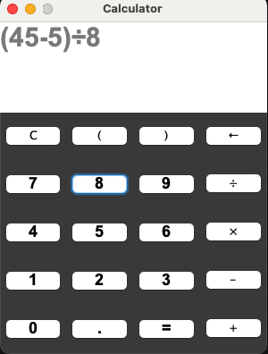

# Simple Calculator using java swing

Simple Calculator using java swing
<p align="center">
  
</p>
 
 ## Requirements
 * Java version 8 or higher.
 * Below instuctions also assume that you have gradle installed on your system. If not, please follow the instructions [here](https://gradle.org/install/)

 ## How to Run the app

 1. Clone this repo and cd to dir
 ```bash
 git clone https://github.com/mirzaevinom/java_projects.git
cd java_projects/calc/
 ```
 1. Build the app
 ```bash
 gradle build
 ```
 1. Run the app 
 ```bash
 gradle run
 ```